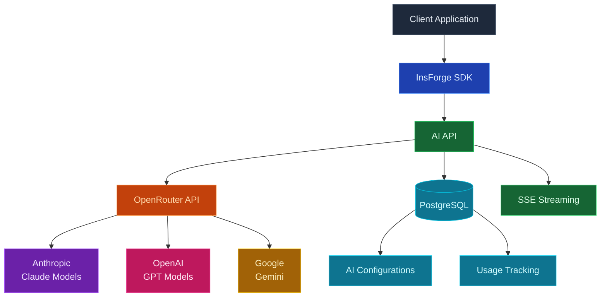
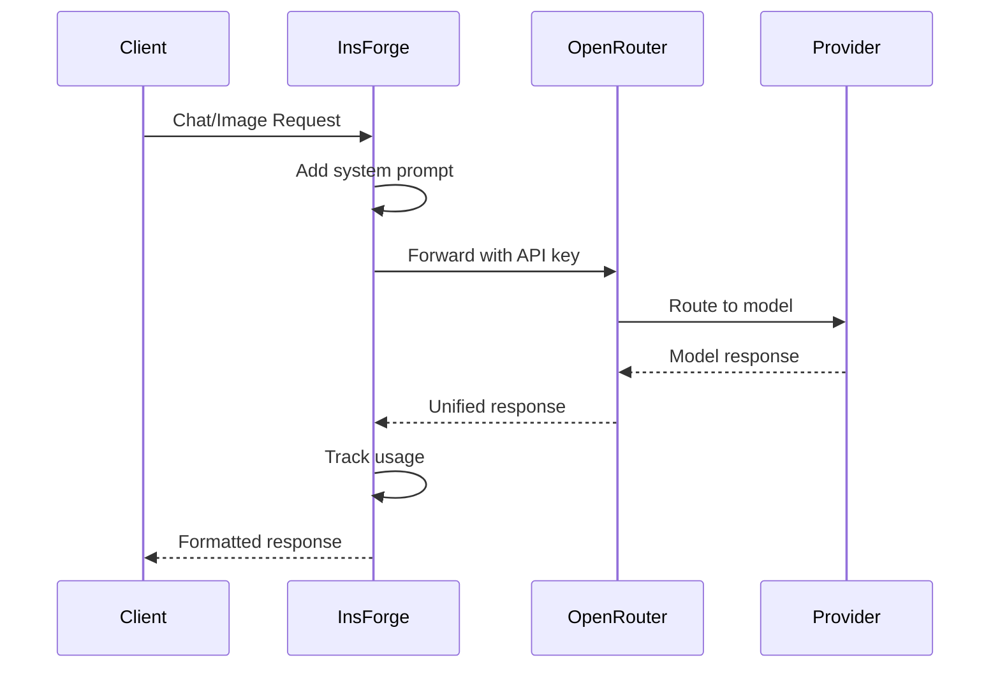

## Overview

InsForge provides unified AI capabilities through OpenRouter, giving you access to multiple LLM providers with a single API and consistent pricing model.

## Technology Stack



## Core Components

| Component | Technology | Purpose |
|-----------|------------|---------|
| **AI Gateway** | OpenRouter | Unified access to multiple AI providers |
| **Chat Service** | Node.js + SSE | Handle chat completions with streaming |
| **Image Service** | Async processing | Generate images via AI models |
| **Configuration** | PostgreSQL | Store system prompts per project |
| **Usage Tracking** | PostgreSQL | Monitor tokens and costs |
| **Response Format** | JSON/SSE | Standard and streaming responses |

## OpenRouter Integration

### Why OpenRouter?

- **Single API**: One integration for multiple providers
- **Unified Billing**: Consistent pricing across models
- **Automatic Failover**: Fallback to alternative models
- **Rate Limiting**: Built-in rate limit handling
- **Cost Tracking**: Usage monitoring and analytics

### Request Flow



## Available Models

### Chat Models

| Provider | Model | ID | Best For |
|----------|-------|----|---------| 
| **Anthropic** | Claude 3.5 Sonnet | `anthropic/claude-3.5-sonnet-20241022` | Complex reasoning |
| **Anthropic** | Claude 3.5 Haiku | `anthropic/claude-3-5-haiku-20241022` | Fast responses |
| **Anthropic** | Claude 3 Opus | `anthropic/claude-3-opus-20240229` | Highest quality |
| **OpenAI** | GPT-4o | `openai/gpt-4o` | General purpose |
| **OpenAI** | GPT-4o Mini | `openai/gpt-4o-mini` | Cost-effective |

### Image Models

| Provider | Model | ID | Capabilities |
|----------|-------|----|--------------| 
| **Google** | Gemini 2.0 Flash | `google/gemini-2.0-flash-thinking-exp-01-21` | Text-to-image generation |

## Chat Completions

### Request Processing

1. **Authentication**: Verify JWT token
2. **Configuration**: Load project AI settings
3. **System Prompt**: Prepend configured prompt
4. **Model Selection**: Use specified or default model
5. **OpenRouter Call**: Forward to OpenRouter
6. **Response Handling**: Stream or batch response
7. **Usage Tracking**: Record tokens and costs

### Streaming Architecture

```javascript
// Server-Sent Events (SSE) for streaming
async function* streamChat(messages, options) {
  const stream = await openRouter.chat.completions.create({
    model: options.model,
    messages: messages,
    stream: true,
    temperature: options.temperature,
    max_tokens: options.maxTokens
  });

  for await (const chunk of stream) {
    if (chunk.choices[0]?.delta?.content) {
      yield { chunk: chunk.choices[0].delta.content };
    }
  }
  
  yield { done: true, tokenUsage: {...} };
}
```

### Response Formats

**Non-streaming Response:**
```json
{
  "response": "AI generated response text",
  "model": "anthropic/claude-3-5-haiku-20241022",
  "usage": {
    "promptTokens": 150,
    "completionTokens": 200,
    "totalTokens": 350
  }
}
```

**Streaming Response (SSE):**
```
data: {"chunk": "The "}
data: {"chunk": "answer "}
data: {"chunk": "is..."}
data: {"done": true, "tokenUsage": {...}}
```

## Image Generation

### Generation Flow

1. **Prompt Processing**: Validate and enhance prompt
2. **Model Selection**: Choose appropriate image model
3. **Size Configuration**: Set dimensions and quality
4. **OpenRouter Request**: Send generation request
5. **URL Generation**: Receive image URLs
6. **Storage Integration**: Optional save to storage
7. **Response Delivery**: Return URLs to client

### Image Parameters

| Parameter | Options | Description |
|-----------|---------|-------------|
| `model` | Model IDs | AI model to use |
| `prompt` | String | Text description |
| `size` | `512x512`, `1024x1024`, etc. | Image dimensions |
| `quality` | `standard`, `hd` | Image quality |
| `numImages` | 1-4 | Number of variations |
| `style` | `vivid`, `natural` | Style preference |

## Configuration Management

### Project-Level Settings

```sql
CREATE TABLE ai_configurations (
  id UUID PRIMARY KEY,
  project_id UUID REFERENCES projects(id),
  model TEXT DEFAULT 'anthropic/claude-3-5-haiku-20241022',
  system_prompt TEXT,
  temperature FLOAT DEFAULT 0.7,
  max_tokens INTEGER DEFAULT 1000,
  created_at TIMESTAMPTZ,
  updated_at TIMESTAMPTZ
);
```

### System Prompts

- Configured per project
- Applied to all chat requests
- Cannot be overridden by client
- Support for multiple configurations

## Usage Tracking

### Metrics Collected

```sql
CREATE TABLE ai_usage (
  id UUID PRIMARY KEY,
  project_id UUID,
  user_id UUID,
  model TEXT,
  operation TEXT, -- 'chat' or 'image'
  prompt_tokens INTEGER,
  completion_tokens INTEGER,
  total_tokens INTEGER,
  cost_cents INTEGER,
  created_at TIMESTAMPTZ
);
```

### Cost Calculation

```javascript
// OpenRouter pricing per 1M tokens
const pricing = {
  'anthropic/claude-3-5-sonnet': { input: 3.00, output: 15.00 },
  'anthropic/claude-3-5-haiku': { input: 0.25, output: 1.25 },
  'openai/gpt-4o': { input: 5.00, output: 15.00 },
  'openai/gpt-4o-mini': { input: 0.15, output: 0.60 }
};

function calculateCost(model, promptTokens, completionTokens) {
  const rates = pricing[model];
  const inputCost = (promptTokens / 1_000_000) * rates.input;
  const outputCost = (completionTokens / 1_000_000) * rates.output;
  return Math.ceil((inputCost + outputCost) * 100); // cents
}
```

## Security & Rate Limiting

<CardGroup cols={2}>
  <Card title="API Key Security" icon="key">
    OpenRouter key stored server-side only
  </Card>
  
  <Card title="Request Validation" icon="shield-check">
    Input sanitization and size limits
  </Card>
  
  <Card title="Rate Limiting" icon="gauge">
    Per-user and per-project limits
  </Card>
  
  <Card title="Usage Quotas" icon="chart-pie">
    Configurable token/cost limits
  </Card>
  
  <Card title="Content Filtering" icon="filter">
    Optional content moderation
  </Card>
  
  <Card title="Audit Logging" icon="file-lines">
    Track all AI operations
  </Card>
</CardGroup>

## Error Handling

### Error Types

| Error | Code | Description |
|-------|------|-------------|
| **Model Not Found** | 400 | Invalid model ID |
| **Rate Limited** | 429 | Too many requests |
| **Token Limit** | 400 | Exceeds max tokens |
| **OpenRouter Error** | 502 | Upstream provider issue |
| **Quota Exceeded** | 402 | Usage limit reached |
| **Invalid Input** | 400 | Malformed request |

### Retry Strategy

```javascript
async function retryableRequest(fn, maxRetries = 3) {
  for (let i = 0; i < maxRetries; i++) {
    try {
      return await fn();
    } catch (error) {
      if (error.status === 429) { // Rate limited
        await sleep(Math.pow(2, i) * 1000); // Exponential backoff
        continue;
      }
      throw error;
    }
  }
}
```

## Performance Optimizations

### Streaming Optimizations

- **Server-Sent Events**: Real-time response streaming
- **Chunked Transfer**: Efficient data streaming
- **Keep-Alive**: Persistent connections for SSE
- **Low Latency**: Direct OpenRouter integration

### Future Optimizations

- **Response Caching**: Cache for identical requests (coming soon)
- **Batch Processing**: Multiple requests in parallel (coming soon)
- **Embeddings Cache**: Store computed embeddings (coming soon)

## Environment Variables

| Variable | Description | Required |
|----------|-------------|----------|
| `OPENROUTER_API_KEY` | OpenRouter API key | Yes |
| `AI_DEFAULT_MODEL` | Default chat model | No |
| `AI_MAX_TOKENS` | Global token limit | No |
| `AI_TEMPERATURE` | Default temperature | No |
| `AI_RATE_LIMIT` | Requests per minute | No |

## Best Practices

<CardGroup cols={2}>
  <Card title="Model Selection" icon="brain">
    Choose models based on speed vs quality needs
  </Card>
  
  <Card title="Prompt Engineering" icon="pencil">
    Craft clear, specific prompts for better results
  </Card>
  
  <Card title="Token Management" icon="coins">
    Monitor usage to control costs
  </Card>
  
  <Card title="Streaming UX" icon="stream">
    Use streaming for better perceived performance
  </Card>
  
  <Card title="Error Recovery" icon="rotate">
    Implement retry logic for transient failures
  </Card>
  
  <Card title="Context Windows" icon="window">
    Manage conversation history within limits
  </Card>
</CardGroup>

## Comparison with Direct Integration

| Aspect | InsForge + OpenRouter | Direct Provider APIs |
|--------|----------------------|---------------------|
| **Integration Effort** | Single API | Multiple integrations |
| **Billing** | Unified through OpenRouter | Separate per provider |
| **Model Access** | 100+ models | Limited to one provider |
| **Failover** | Automatic | Manual implementation |
| **Cost Tracking** | Built-in analytics | Custom implementation |
| **Rate Limiting** | Handled by OpenRouter | Per-provider limits |