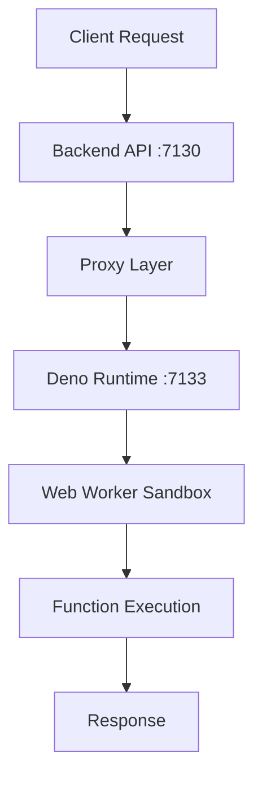

## What are Insforge Functions?

Insforge Functions are serverless JavaScript/TypeScript functions that run in an isolated Deno runtime environment. They enable you to execute custom backend logic with full access to the Insforge SDK and backend services.

<CardGroup cols={2}>
  <Card title="Secure Execution" icon="shield-halved">
    Functions run in isolated Web Workers with sandboxed environments
  </Card>
  <Card title="SDK Integration" icon="plug">
    Full access to Insforge SDK for database, auth, and storage operations
  </Card>
  <Card title="Environment Variables" icon="key">
    Secure secrets management with encrypted storage
  </Card>
  <Card title="Auto-scaling" icon="chart-line">
    Automatically scales based on demand with no server management
  </Card>
</CardGroup>

## Architecture

Insforge Functions utilize a multi-layer architecture for security and performance:

### Components

<AccordionGroup>
  <Accordion title="Backend API Layer">
    - Manages function CRUD operations via `/api/functions`
    - Handles authentication and authorization
    - Proxies execution requests to Deno runtime
  </Accordion>
  
  <Accordion title="Deno Runtime">
    - Isolated execution environment
    - Manages worker lifecycle
    - Injects secrets and SDK access
  </Accordion>
  
  <Accordion title="Web Worker Sandbox">
    - Each function runs in its own worker
    - 30-second execution timeout
    - No file system or network access except through SDK
  </Accordion>
</AccordionGroup>

## Key Features

### 🚀 Instant Deployment
Deploy functions immediately with a single API call. Changes take effect instantly without build steps.

### 🔐 Built-in Security
- Sandboxed execution environment
- Encrypted secrets storage
- Automatic authentication handling
- Request validation and sanitization

### 📊 Full SDK Access
Access all Insforge services from your functions:
- Database operations
- Authentication & user management
- File storage
- AI integrations

### 🌐 HTTP-based Triggers
Functions are triggered via HTTP requests, supporting:
- All HTTP methods (GET, POST, PUT, DELETE, etc.)
- JSON request/response bodies
- Custom headers
- Query parameters

## Use Cases

<CardGroup cols={2}>
  <Card title="Webhooks" icon="webhook">
    Process webhooks from external services like Stripe, GitHub, or Slack
  </Card>
  <Card title="API Endpoints" icon="server">
    Create custom REST API endpoints for your application
  </Card>
  <Card title="Data Processing" icon="database">
    Transform, validate, or enrich data before storage
  </Card>
  <Card title="Scheduled Tasks" icon="clock">
    Run periodic tasks like cleanup or synchronization
  </Card>
  <Card title="Third-party Integrations" icon="puzzle-piece">
    Connect with external APIs and services securely
  </Card>
  <Card title="Custom Business Logic" icon="code">
    Implement complex business rules and workflows
  </Card>
</CardGroup>

## Limitations

<Warning>
  **Single Endpoint Only**: Each function has exactly one endpoint. Functions do NOT support subpaths.
  - ✅ Works: `/functions/my-api`
  - ❌ Doesn't work: `/functions/my-api/users`
</Warning>

### Execution Constraints
- **Timeout**: 30 seconds maximum execution time
- **Memory**: Limited by Deno worker allocation
- **No Direct File Access**: Use Storage API for files
- **No System Commands**: Process spawning is prohibited

### Development Constraints
- Functions are stateless (no persistent variables)
- Cannot import external npm packages (only `@insforge/sdk`)
- TypeScript supported but not type-checked at runtime

## Next Steps

<CardGroup cols={2}>
  <Card title="Quickstart Guide" icon="rocket" href="/core-concepts/functions/quickstart">
    Create your first function in minutes
  </Card>
  <Card title="SDK Reference" icon="book" href="/core-concepts/functions/sdk">
    Learn about the Functions SDK
  </Card>
  <Card title="Examples" icon="code" href="/core-concepts/functions/examples">
    Explore real-world function examples
  </Card>
  <Card title="Security" icon="lock" href="/core-concepts/functions/security">
    Understand security best practices
  </Card>
</CardGroup>