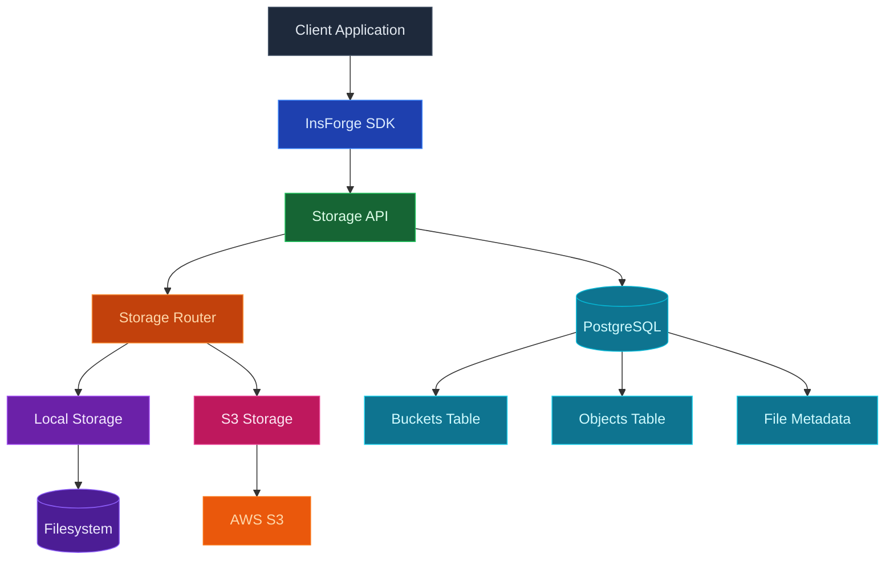
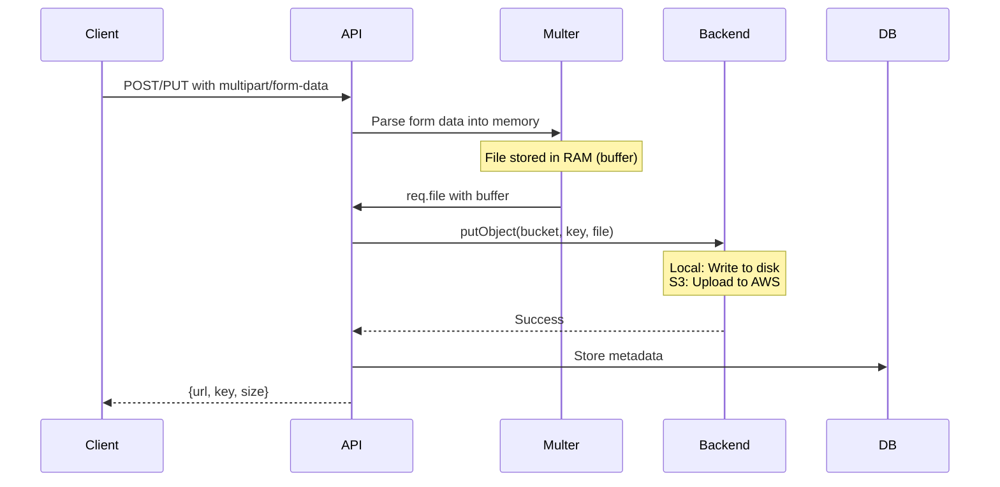
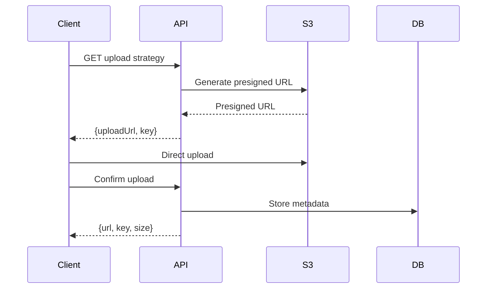

## Overview

InsForge provides a unified storage API that works with both local filesystem for development and AWS S3 for production, allowing seamless transition between environments.

## Technology Stack



## Core Components

| Component | Technology | Purpose |
|-----------|------------|---------|
| **Local Backend** | Node.js fs | Development storage using filesystem |
| **S3 Backend** | AWS SDK v3 | Production storage with AWS S3 |
| **Metadata Store** | PostgreSQL | File metadata, bucket configuration |
| **Upload Handler** | Multer | Multipart form data parsing (both backends) |
| **URL Strategy** | Presigned URLs | Secure direct uploads/downloads (S3 only) |
| **Access Control** | JWT + Bucket visibility | Public/private bucket permissions |

## Storage Backends

### Local Storage (Development)

```javascript
// Local storage structure
/data/storage/
├── bucket-1/
│   ├── file1.jpg
│   ├── folder/
│   │   └── file2.pdf
│   └── ...
├── bucket-2/
│   └── ...
```

**Features:**
- Files stored on local filesystem
- Direct file access via API
- No external dependencies
- Instant setup for development

### AWS S3 Storage (Production)

**Features:**
- Presigned POST URLs for direct uploads
- Presigned GET URLs for secure downloads
- IAM role-based authentication on EC2
- Multi-tenant isolation with app key prefix

**Configuration:**
- Uses IAM roles when deployed on EC2
- No hardcoded credentials needed
- Bucket per deployment with app key prefix

## Upload Strategies

### Direct Upload (Both Local and S3)



### Presigned URL Upload (S3)



## Bucket Configuration

### Bucket Types

| Type | Access | Use Case |
|------|--------|----------|
| **Public** | No auth required for downloads | Public assets, images, static files |
| **Private** | Auth required for all operations | User files, sensitive documents |

### Bucket Metadata

```sql
CREATE TABLE _storage_buckets (
  name TEXT PRIMARY KEY,
  public BOOLEAN DEFAULT TRUE,
  created_at TIMESTAMPTZ DEFAULT NOW(),
  updated_at TIMESTAMPTZ DEFAULT NOW()
);
```

## File Operations

### Upload Flow

1. **Request Upload**: Client requests upload permission
2. **Validation**: Check auth, bucket permissions, file size
3. **Strategy Selection**: Choose direct or presigned based on backend
4. **Upload**: Client uploads via selected method
5. **Confirmation**: Verify upload and store metadata
6. **Response**: Return file URL and metadata

### Download Flow

1. **Request File**: Client requests file access
2. **Permission Check**: Verify bucket/object permissions
3. **Strategy Selection**: Direct serve or presigned URL
4. **Delivery**: Stream file or redirect to URL

## Security Features

<CardGroup cols={2}>
  <Card title="Bucket Policies" icon="shield">
    Public, private, or protected bucket access control
  </Card>
  
  <Card title="JWT Authentication" icon="key">
    Token-based access for private resources
  </Card>
  
  <Card title="Presigned URLs" icon="link">
    Time-limited URLs for secure S3 access
  </Card>
  
  <Card title="MIME Type Validation" icon="file-check">
    Restrict uploads to allowed file types
  </Card>
  
  <Card title="Size Limits" icon="weight">
    10MB default, configurable via MAX_FILE_SIZE
  </Card>
  
  <Card title="App Key Isolation" icon="key">
    Multi-tenant isolation using app key prefix in S3
  </Card>
</CardGroup>

## Database Schema

### Storage Tables

```sql
-- Buckets table
CREATE TABLE _storage_buckets (
  name TEXT PRIMARY KEY,
  public BOOLEAN DEFAULT TRUE,
  created_at TIMESTAMPTZ DEFAULT NOW(),
  updated_at TIMESTAMPTZ DEFAULT NOW()
);

-- Storage metadata table
CREATE TABLE _storage (
  bucket TEXT NOT NULL,
  key TEXT NOT NULL,
  size INTEGER NOT NULL,
  mime_type TEXT,
  uploaded_at TIMESTAMPTZ DEFAULT NOW(),
  PRIMARY KEY (bucket, key),
  FOREIGN KEY (bucket) REFERENCES _storage_buckets(name) ON DELETE CASCADE
);
```

### URL Formats

| Backend | Format | Example |
|---------|--------|---------|
| **Local** | `/api/storage/buckets/{bucket}/objects/{key}` | `/api/storage/buckets/avatars/objects/user123.jpg` |
| **S3 Public** | `https://{bucket}.s3.{region}.amazonaws.com/{key}` | `https://mybucket.s3.us-east-1.amazonaws.com/file.pdf` |
| **S3 Presigned** | Time-limited URL with signature | Complex URL with query parameters |

## Performance Optimizations

### Caching Strategy

- **CDN Integration**: CloudFront, Cloudflare (coming soon)
- **Browser Caching**: Cache-Control headers
- **ETag Support**: Conditional requests for S3
- **Compression**: Response compression via middleware

### Upload Methods

**1. Direct Upload through API Server:**
- Client sends file to `/api/storage/buckets/{bucket}/objects`
- File passes through API server memory
- Server writes to local disk or uploads to S3
- Limited by server memory (10MB default)

**2. Presigned URL Upload (S3 only - Recommended):**
- Client requests upload URL from `/api/storage/buckets/{bucket}/upload-strategy`
- Server returns presigned POST URL
- Client uploads directly to S3 (bypasses API server)
- No server memory constraints
- Client confirms upload via `/api/storage/buckets/{bucket}/objects/{key}/confirm-upload`

## Configuration

### Environment Variables

| Variable | Description | Example |
|----------|-------------|---------|
| `AWS_S3_BUCKET` | S3 bucket name (enables S3 backend) | `my-app-storage` |
| `AWS_REGION` | AWS region | `us-east-2` |
| `APP_KEY` | App key for S3 multi-tenancy (required for S3) | `my-app-key` |
| `STORAGE_DIR` | Local storage path (optional) | `./data/storage` |

### S3 Configuration

```javascript
// S3 client configuration
const s3Client = new S3Client({
  region: this.region, // e.g., 'us-east-2'
  // IAM role credentials are automatically used on EC2
  // No explicit credentials needed in production
});

// File paths use app key prefix for multi-tenancy
const s3Key = `${this.appKey}/${bucket}/${key}`;
```

## Best Practices

<CardGroup cols={2}>
  <Card title="Use Buckets" icon="folder">
    Organize files logically in buckets
  </Card>
  
  <Card title="Set Limits" icon="gauge">
    Configure appropriate size/type limits
  </Card>
  
  <Card title="Clean URLs" icon="link">
    Use consistent, SEO-friendly key naming
  </Card>
  
  <Card title="Metadata" icon="tags">
    Store searchable metadata in database
  </Card>
  
  <Card title="Backup Strategy" icon="cloud-arrow-up">
    Implement regular backups for production
  </Card>
  
  <Card title="Monitor Usage" icon="chart-line">
    Track storage costs and usage patterns
  </Card>
</CardGroup>

